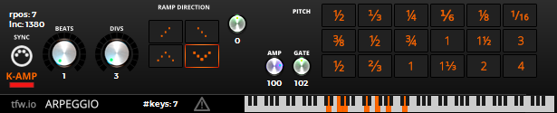

<!-- Author:tfw
Author-meta:tfw
Title:Arpeggiator
Subtitle: progress
Date:20170417
Encoding:utf8
version:tfwio.wordpress.com
mainfont:Roboto Slab
monofont:FreeMono
monoscale:0.8
dh:8in
dw:5in
top:0.75in
bottom:0.75in
lr:0.35in -->

# arp

[WIP] a simple arpeggiator vst instrument/effect using iplug/wdl-ol;

its a fairly simple arpeggiator called 'arpeggio' for the moment.

accompanied by the horrible readme...

To tell you the honest truth, I don't know how much time I'm going to be spending on updating this.  It just kind of popped into existance over the past couple weeks and fleshed into what you see—guess we'll see what this turns into.
Mostly, I just wanted to elaborte some midi-controller enhancements for playing with my midi-piano in ardour as well as perhaps sandbox some MIDI timing/triggering stuff.  Also there are no binaries at the moment until I get a few more ramp types and possibly re-work the UI a bit (am in no rush).  I'd say that this is a pretty decent IPLUG/WDL-OL MIDI example, but there are a few IPLUG hacks and also its not quite cross-platform at the moment.



- **PITCH CONTROL** (&sect;ee notes)  
  knob to re-pitch [-128 to 127].
- **UI KEYBOARD** (&sect;ee notes)  
    - left click sends midi messages downstream
    - right click (and drag) to clear depressed notes
    - middle-click on the keys to depress a given key
- "**K-AMP**" on/off switch/button toggles enabling a amplitude knob which forces midi messages to the particular amp or otherwise relies on what you press in your midi keyboard (or in the tiny UI keys---the lower the louder)
- **GATE** (&sect;ee notes)  
  knob controls the percentage (1-200%) of the note length.  It could easily overlap and mess up your on/off triggers if you're not wise in using it ;)
- **TIMING**: BEATS (1-16) VS DIVS (1-64) knobs for controlling as well as...  
  an array of trigger buttons that trigger different timings.  It was kind of just thrown into the concept and left there as it is for the time being.  
  Currently there are three rows.  the first TOP row are [1/n] divisions.  Second row: [3/n] divisions and finally [4/n] divisions.
  Will likely change the potential beat-count parameter to be a higher maximum setting such as 64 and perhaps even something arbitrary, set by user.
- **SYNC** button [on/off] should sync the timing to the DAW transport/clock if the transport is running.  if for some reason it loses sync, hit play in your daw's transport and when you press 'stop' it will have re-synced (of course if sync was enabled when you did this)
- **PANIC** button (triangle looking thing near the KB) releases all depressed keys/notes
- **RAMPING** 4 ramp modes at the moment: up, down, up-down and down-up.
  I'll probably release binaries when I get the last two ramping methods in there; or is it four more. Am looking to add something like [0-1-2-1-2-3*], its reversal and ping-pongs for each direction.

## NOTES and EXPLANATIONS

**PITCH CONTROL** — Ignores notes calculated out of range of [0-127].  This is one of the last intended features that I added and once I played with it, I was a bit let down to see that I'm now going to have to clean up and predict when notes are going to bump into each other.  For tinkering around, this feature is fine but if you are looking to generate clean MIDI when tinkering around with this guy, you will find erronious MIDI data needing cleaning.

**UI KEYBOARD** &mdash; Is a little buggy when it comes to turning off the last note depressed since I had spent the least amount of time working a few changes into Tale's MIDI-Keyboard `IControl`.  You're better off just right-clicking to wipe clean all the notes and use the MIDDLE-CLICK-BUTTON to set whatever it is that you're trying to depress.

The Keyboard acts as your MIDI keyboard until you click with the MIDDLE_BUTTON (Mouse Wheel Button) to get a key (or many) to "stick", and use the RIGHT_CLICK to clear the keys depressed as such.

----

Concerning the pitch-control and timing trigger buttons: If you go all button crazy, you're bound to generate some unwanted MIDI.

## WINDOWS DEVS

- wdl-ol/iplug
- see github.com/tfwio/twix
    - common includes and few cpp dependencies are in there.
    - wihtout the notes on the readme there this would be fairly difficult to compile.
- using VisualStudio 2013 Express load the SLN (**Arpeggio.sln**)
    - **arpeggio_i-vst2.vcproj** some DAW that can't handle VST-midi-effect specs so there's an instrument version.
    - **arpeggio-vst2.vcproj** is the effect version that works in DAWs properly supporting VST midi effects.

## NON-WINDOWS (noop)

It would be nice to see this working on a mac but I'm probably not going to be getting to that, though I'd like to write up some makefiles for mingw/msys2.
If you would like to get it working in something other than windows, you're going to have to reference the vcproj's until that imaginary day makefiles or some other reference comes into existance.
Also (again), we're going to need to parallel and clean up a couple of things like a few mouse-related API (that aren't implemented yet here in a particular number-control), the timer mechanism noted in the 'twix' readme and perhaps some other things that are hard-wired to windows if I missed something I didn't document —there really shouldn't be any real difficulty I'm thinking, once all the right files, paths and preprocessor definitions are in place.

# Arpeggiators

**WHAT IS AN ARPEGGIATOR?**  
[Secrets of the Arpeggiator](http://archive.oreilly.com/pub/a/oreilly/digitalmedia/2006/06/29/secrets-of-the-arpeggiator.html) — by Jim Atkin of O'Reilly Digital-Media (20060629).  
Wikipedia — [Arpeggio](https://en.wikipedia.org/wiki/Arpeggio)

Firstly, most DAW include some form of an arpeggiator.

The following table is what has it my radar.  There are more.

| name         | type       | vendor uri |
|--------------|------------|------------|
| Blue Arp     | free       | [graywolf2004.net](http://graywolf2004.net/wp/)
| Catanya      | commercial | [see me](http://www.synthtopia.com/content/2009/08/07/catanya-vst-midi-arpeggiator-plugin/), search youtube.
| Kirnu        | commercial\* | [kirnuarp.com](http://www.kirnuarp.com/)
| Nora, NoraCM | commercial\* | [squaredheads.com](https://squaredheads.com/)

- \**Kirnu demo doesn't allow you to store presets but works fine otherwise (I'm told)*
- \**NoraCM is distributed with Computer Music magazine (including digital editions).*


## CLOCK/TIMING

```cpp
// timing calculation
inline int32 calculate()
{
  Bb = ((60.0 * mSampleRate / mBpm));
  Lb = double(mBeat) * (1. / double(mDiv)); 
  if (Lb <= 0.) Lb = 0.00001; // prevent zero division

  double actualLength = Bb * Lb;
  mNoteDurationOn = int32(floor(actualLength));
  mNoteDurationOff = int32(floor((actualLength * mGateDiv))); // *bad

  return mNoteDurationOn;
}
```

- Bb (class member) is our calculated beat
- Lb (class member) is the length of a beat division.

# license

some version of this will remain here in the public domain as such.  
see the MIT license if you really want to read something.